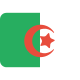
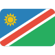
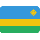

# FlatUIAfricanFlags
A collection of flat UI styled African flags.

## Format

All flags are set in `svg` format as well as `png` for your convenience.

## Flags

     

      

     

     

     

      

     

     

     

  

## License
MIT
